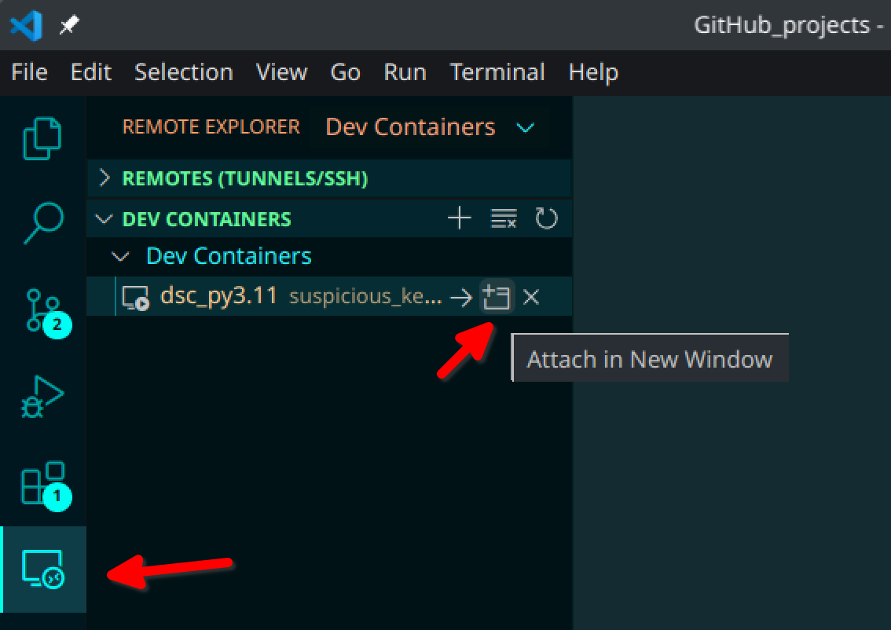

# Beginner's Guide to Creating a Data Science Developer Environment with Docker

## Purpose
This guide provides step-by-step instructions for setting up a Data Science developer environment using Docker. It can be used on any operating system and offers a convenient and consistent environment for Data Science projects.

## Why Use a Dockerized Developer Environment?
- Ensures consistency across different machines.
- Easily shareable and reproducible.
- Isolation from the host machine, preventing conflicts with existing software installations.
- Allows for easy scaling and deployment of projects.

## Requirements
- VS Code installed on the machine.
- Docker installed on the machine.

## Steps

### 1. Create a Main Folder
Create a main folder where all your Data Science projects will be stored. For example, you can create a folder named `Github_projects`.

### 2. Open the Folder in VS Code
Open the main folder (`Github_projects` in this example) in VS Code.

### 3. Install Microsoft Extensions on VS Code
Install the following extensions from the VS Code marketplace:
- Docker
- Remote - Containers

### 4. Create a `requirements.txt` File
In the root of your project folder, create a file named `requirements.txt`. This file should list all the Python libraries your projects will depend on. For example:
```
numpy
pandas
matplotlib
seaborn
scikit-learn
```

### 5. Create a Docker Image File (`Dockerfile`)
Create a `Dockerfile` in the root of your project folder with the following content:

```Dockerfile
FROM python:3.11

WORKDIR /app

COPY . /app

RUN pip install -r requirements.txt && \
    pip install ipykernel && \
    python -m ipykernel install --user --name=myenv

CMD ["jupyter", "notebook", "--ip='*'", "--port=8888", "--no-browser", "--allow-root"]
```

In this Dockerfile, ipykernel is installed, and then the IPython kernel is added to Jupyter with the name myenv. When you start Jupyter notebook in your container, you should now be able to select the **myenv** kernel to run your notebook cells.

### 6. Build the Docker Image
Open a terminal in VS Code and run the following command to build the Docker image:
```
docker build -t my_dev_env .
```

This command builds a Docker image named my_dev_env based on the Dockerfile in the current directory (.).

### 7. Run the Docker Container
Run the following command in the terminal to start a Docker container using the image you just built:
```
docker run -it -v $(pwd):/app my_dev_env bash
```

This command starts a Docker container based on the my_dev_env image and opens a bash shell inside the container. The -v $(pwd):/app option mounts the current directory into the container at /app, allowing you to access your project files from within the container.

### 8. Attach the Container to VS Code
In the left panel of VS Code, click on the "Remote Explorer" icon.
Find your running container under "Containers" and click "Attach in New Window".
A new VS Code window will open attached to your running Docker container.



### 9. Start Developing
In the new VS Code window attached to your Docker container, you can start developing your Data Science projects using Python, Jupyter Notebook, and other tools.

### 10. Clone Repositories
Clone any additional repositories you need for your projects into the main folder (Github_projects).


`This guide should help you set up a basic Data Science developer environment using Docker. Feel free to customize it further based on your specific needs and preferences.`
